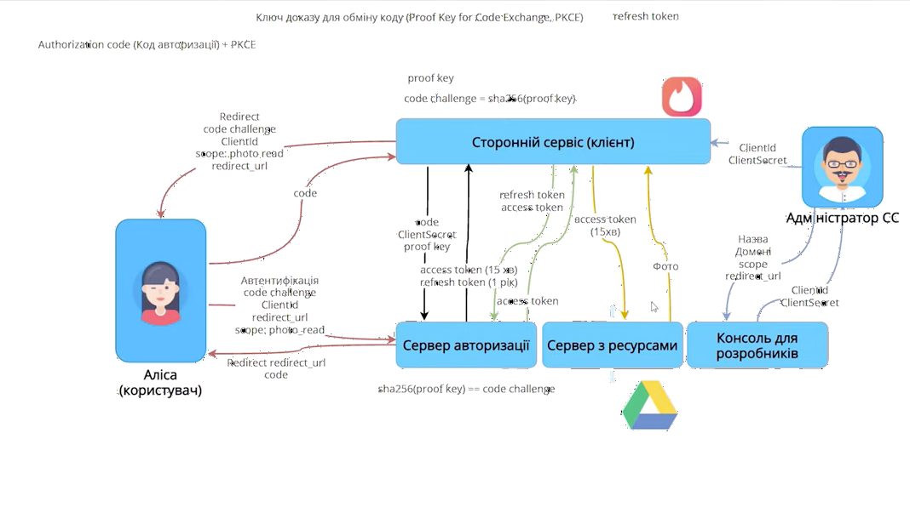

== Security
:toc:

=== 1.* https://www.cyberciti.biz/faq/authentication-vs-authorization/[Authorization & Authentication]
=== 2.* https://www.youtube.com/watch?v=n4eV7NH-p-I[OAuth]
- Grand password
- Implicit flow
- Authorization code
- Authorization code + PKCE (proof key for code exchange)
- Authorization code + PKCE + refresh token

=== 3. https://martinfowler.com/articles/web-security-basics.html [Basic web-app security]
=== 4.* https://jwt.io/introduction/[JWT]
=== 5. Vulnerabilities:
- https://www.imperva.com/learn/application-security/cross-site-scripting-xss-attacks/[XSS]
- https://www.imperva.com/learn/application-security/sql-injection-sqli/[SQL Injections]
- https://www.imperva.com/learn/application-security/csrf-cross-site-request-forgery/?redirect=Incapsula[CSRF]
- https://www.imperva.com/learn/application-security/rfi-remote-file-inclusion[Remote File Inclusion]

=== 6. https://developer.mozilla.org/en-US/docs/Web/Security/Same-origin_policy[Same-origin Policy]
=== 7. https://auth0.com/blog/refresh-tokens-what-are-they-and-when-to-use-them/[Tokens & Cookies]
