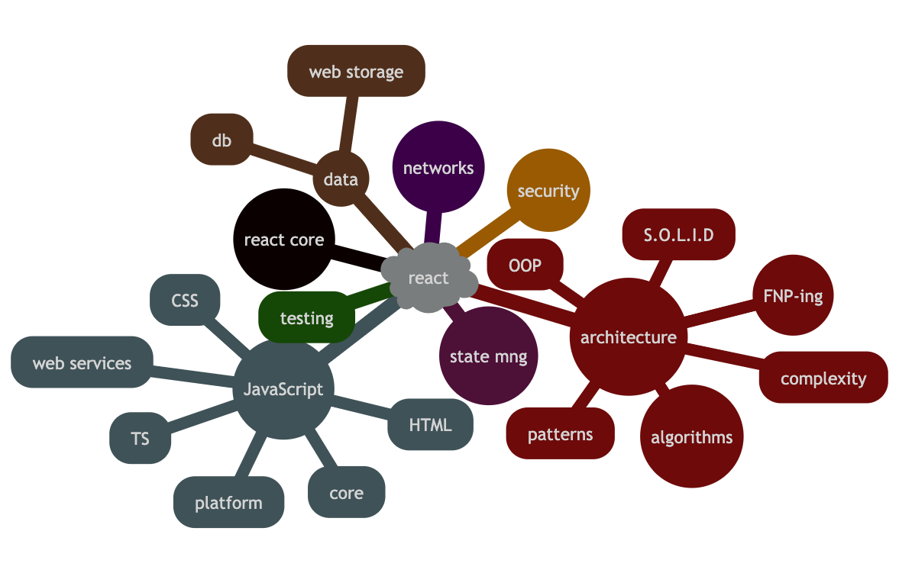

= Knowledge
:toc:
:customcss:

|===
|Competency|Level

|link:coreTechnology/coreTechnology.adoc[Core Technology]
|
|JavaScript/ECMAScript Core
|[green]#Specialist#
|HTML
|[green]#Specialist#
|Typescript
|[blue]#Entry#
|CSS
|[green]#Specialist#
|Web Services
|[green]#Specialist#
|Mobile / Desktop Development / Hybrid
|[blue]#Entry#

|link:webFrameworks/webFrameworks.adoc[Web Frameworks]
|
|React
|[green]#Specialist#

|link:data/data.adoc[Data]
|
|Data
|[blue]#Entry#

|link:designArchitecture/designArchitecture.adoc[Design and Architecture]
|
|Design / Architecture
|[green]#Specialist#

|link:configurationAndNetworks/configurationAndNetworks.adoc[Configuration and Networks]
|
|CI/CD
|[green]#Specialist#
|Networks
|[blue]#Entry#
|Security
|[blue]#Entry#
|Cloud
|[blue]#Entry#

|link:codeQuality/codeQuality.adoc[Code Quality]
|
|Testing
|[blue]#Entry#
|Code Quality / Best Practices
|[blue]#Entry#
|link:coreTechnology/coreTechnology.adoc[Engineering Processes]
|[blue]#Entry#

|===

*How to use?*

The Fronted developer is a person hwo know not only React as a library, this is a person hwo can developing any websites, becaouse he knows staff around frontend:

- How browser work;
- Html5, css3, core JS;
- Which protocols are using;
- Which patterns are useful and how they are work;
- What problems react solving;

All these points are help you to grow. We prepare for yo some useful information. First of all you can find the most valuable topics by using global search to find '\*'. However, we suggest you to start with `coreJS`, `HTML` and `CSS` to be familiar with. Then move to the React, after that all other topics marked by '\*'.